# Stu · Family Table

A household meal-planning app built around the fridge. What is in the fridge
decides what gets cooked: shop from a note on the fridge door, cook ahead on the
weekend and freeze the extra, plan the week with Stu (the AI helper), then cook
and tick meals off day by day. Recipes come from text, photos or links.

Live at **https://stu.dodofamily.com** · a no-sign-in simulation at
**[/demo](https://stu.dodofamily.com/demo)**. English controls, Chinese recipes
and food names throughout; phone and desktop.

Stack: FastAPI + PostgreSQL, Next.js, a Friday worker, an authenticated MCP API.
Pushing to `main` deploys to Google Cloud Run (see [Deploy](#deploy)).

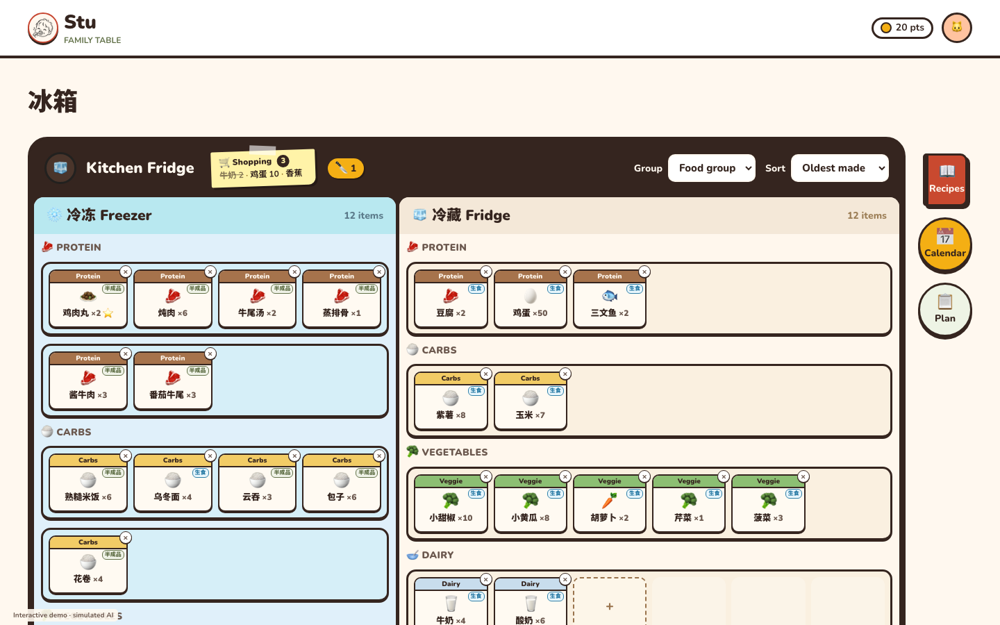

## What it does

### The fridge is home
Freezer and fridge side by side, foods grouped on shelves by food group (or
sorted by date or name), as many small cards to a shelf as the screen fits.
Beside it: the recipe book, the Calendar and the Plan. Every other page has the
little fridge button back home; the Calendar, which sits between the plan and the
shopping, goes back to Plan and on to Shopping & prep. Drag a box between shelves or compartments;
tap it to edit, or take it out with its ×.

### 🔪 + Prep: cook ahead from what is in the fridge
Hold a food (or ⌘/Ctrl/Shift-click it) to choose it, choose a few more, and tap
**🔪 + Prep**. Stu makes a dish from them in the background: close the drawer,
choose other foods, start another. The 🔪 tag on the fridge lists the dishes on
their way; review one, change anything (or use a recipe instead), and add it to
this weekend's prep day, or discard it. A dish Stu makes is not saved to the
recipe book.

| Choose foods | Dishes on their way |
|---|---|
| 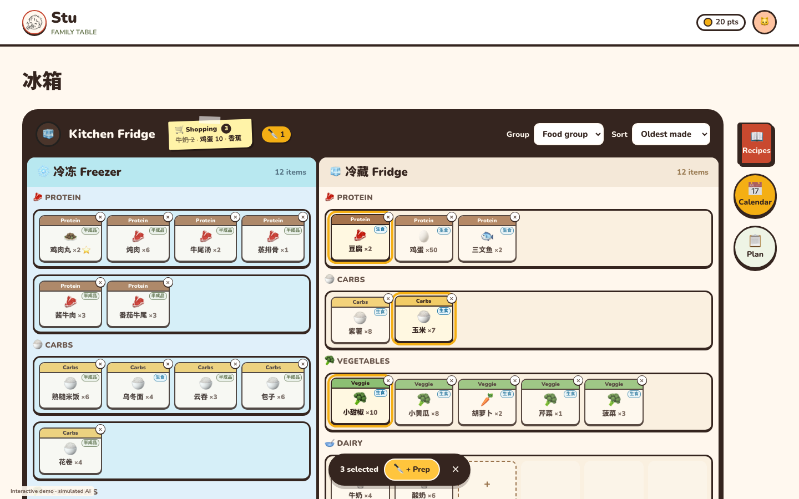 | 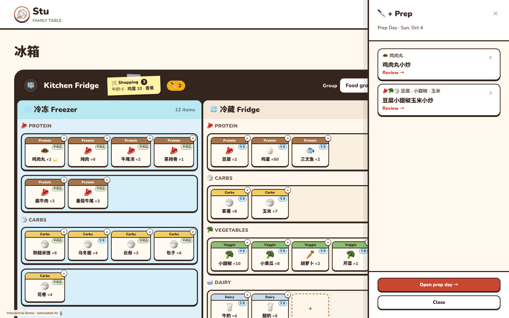 |

On prep day a + Prep dish is marked **Done** with only what is left over: how
many extra portions, and freezer or fridge. Its foods are taken from the fridge;
nothing extra leaves no empty box. It can be cooked before next week's plan is
confirmed.

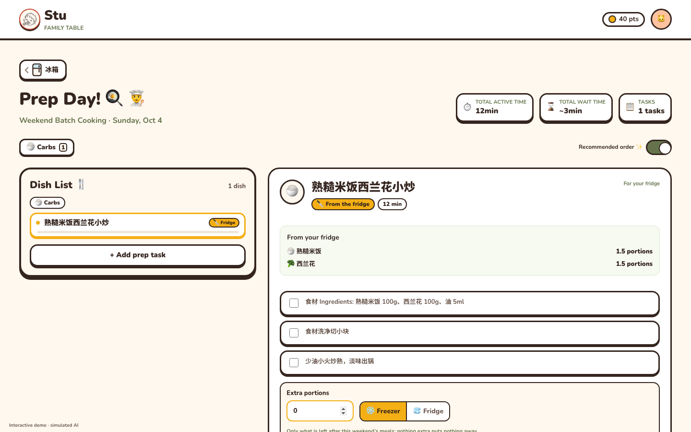

### A shopping note on the fridge door
A plain list: add rows as you think of them ("牛奶 2", "鸡蛋*12", "2盒牛奶" all
read the amount), tick what you bought, and **Put in fridge**: each goes in with
its portions and compartment, keeping the group and icon of the same food
already in the fridge, and leaves the note.

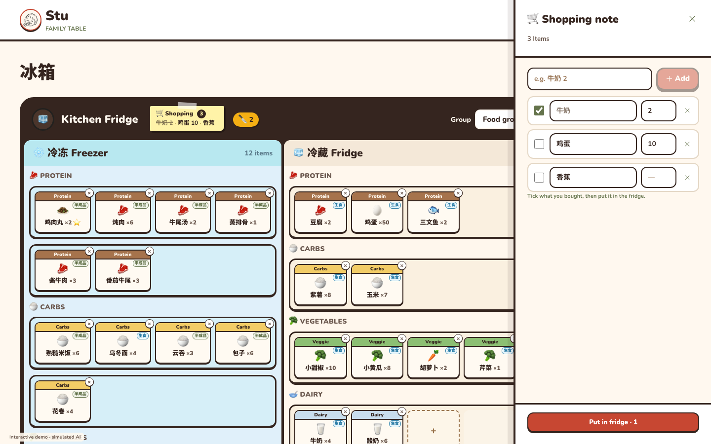

### Calendar: cook and record
Each meal card reads in three rows: the meal and its time; the dishes; where
the food comes from, with ✓ Done / ✗ Skip / ♥ Liked. Done takes the portions
from the fridge; **Changed** records a meal that went differently, with an
optional note, and takes nothing. Every action can be undone. While the week is
being edited on the Plan page, the Calendar keeps the confirmed version and
what it records follows into the edit.

| Week | Cooking a meal |
|---|---|
| 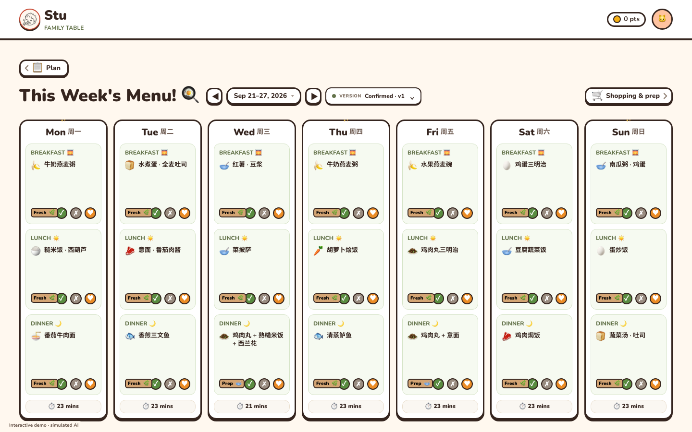 | 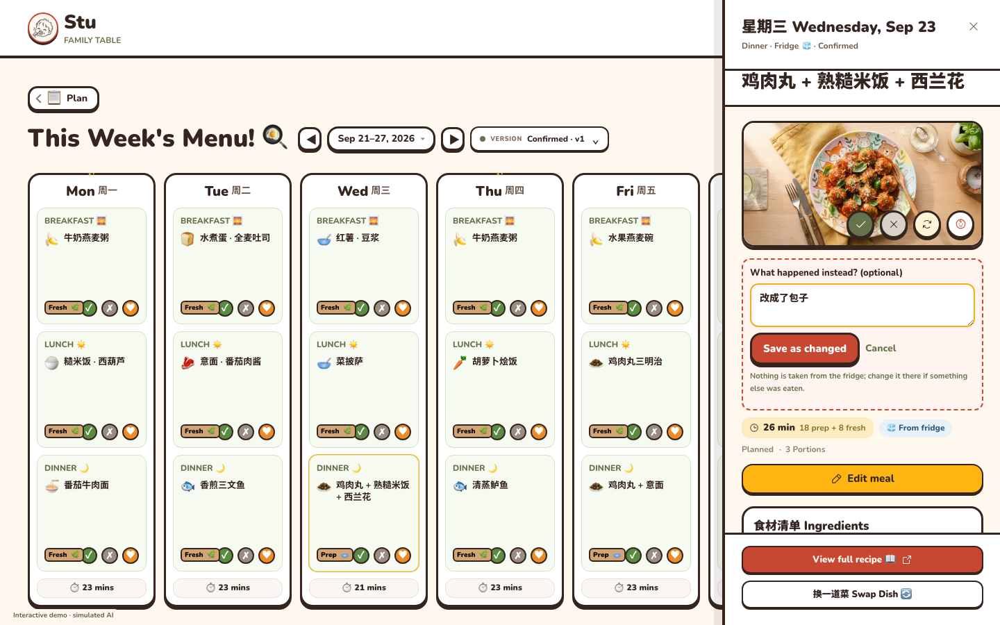 |

### Plan: the week with Stu
Say what the week needs; Stu drafts it from the fridge, the recipes and the
household's rules (allergies, the child's age, time limits, repeats). Adjust it
in chat (apply only the changes you pick) or by hand: a meal opens straight into
editing, one card per dish (source: fridge, recipe or make your own; portions;
food groups; ingredients; steps; time). Leave blanks and Stu fills them when you
save; what it fills stays with the meal. Confirm, and the week is confirmed at once: meals can be marked on the Calendar
while Stu prepares the shopping list and prep day in the background.

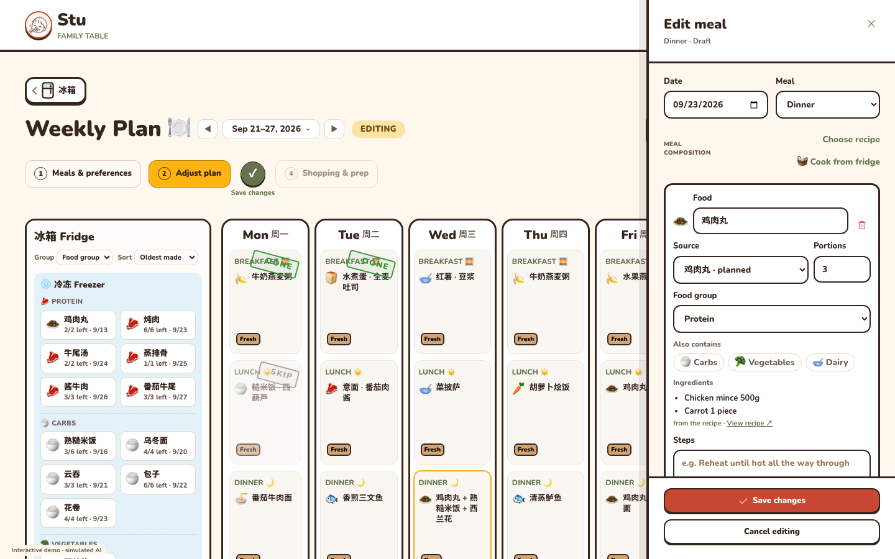

### Recipe book
Search by name, ingredient or tag; **🧊 Uses my fridge** puts first the recipes
the fridge can make the most of and shows "🧊 3/5". Import from text, photos or a
link (小红书, B站, YouTube, Instagram or any recipe page): the server reads only
the public page (private addresses and redirects to them are refused; 10 s and
2 MB at most) and Stu drafts the recipe for you to review. A recipe can be saved
incomplete; Stu fills its blanks.

| Uses my fridge | Import from a link |
|---|---|
| 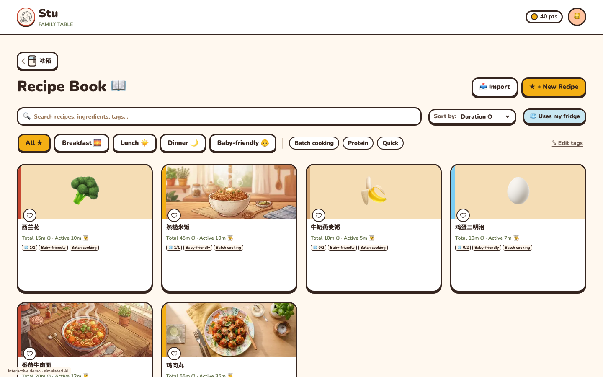 | 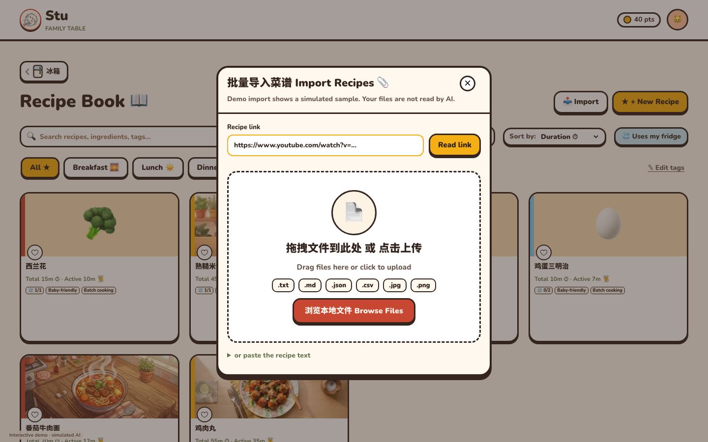 |

### On a phone
The same pages; the fridge's buttons float at the bottom right.

<p>
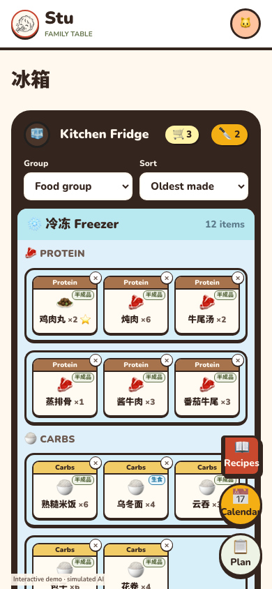
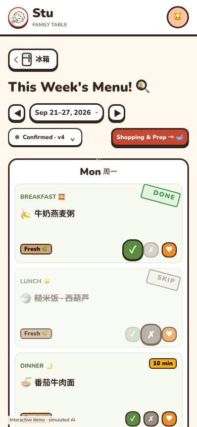
</p>

### MCP: Stu for other AI assistants
`POST /api/v1/kitchen/mcp` with `Authorization: Bearer stu_…` (a token made in
Settings) gives an assistant the same household: `kitchen_read`,
`kitchen_command` (every engine command: fridge, recipes, plans, meals, prep,
the shopping note, undo), `kitchen_generate` / `kitchen_chat` /
`kitchen_task_apply` (with `mealIds` for part of an answer),
`kitchen_extract`, `kitchen_import_link`, `kitchen_fill` and `kitchen_compose`.
Previews never save. See [docs/MCP.md](docs/MCP.md).

## Run the real app

1. Open `.env` and fill `OPENAI_API_KEY`. The prepared local file has application
   secrets already generated. `.env.example` documents every setting. If setting
   up a new checkout, copy the example and generate three distinct random secrets.
2. Start Docker Desktop, then run:

   ```sh
   docker compose --env-file .env -f infra/compose.yaml up -d --build
   ```

3. Open **http://localhost:13107/fridge** and sign in with your email. Local
   development signs in directly; it does not send an email. A new household starts
   empty. Add food and household guidance, optionally import nutrition references
   in Knowledge, then generate a plan. An empty recipe library is supported: AI
   creates complete recipes together with the draft.

After editing the API key or model in `.env`, reload the API and both workers:

```sh
docker compose --env-file .env -f infra/compose.yaml up -d --force-recreate api worker dispatcher
```

Use the same hostname (`localhost`) for the Web app and API so session cookies work.
`/demo` is deliberately a separate local simulation; it is not the real workspace.
Without an AI key, manual planning, recipe editing, stock and execution remain usable;
AI generation, chat and extraction report the missing configuration instead of faking output.

## Develop and test

```sh
uv sync --all-groups --frozen
pnpm install --frozen-lockfile
uv run pytest
uv run ruff check src tests migrations scripts
uv run mypy src
pnpm --dir web test
pnpm --dir web typecheck
pnpm --dir web lint
pnpm --dir web build
uv run python scripts/run-kitchen-e2e.py
```

The browser suite creates its own temporary PostgreSQL database on the local Docker
PostgreSQL service, applies every migration, runs a real API, and tests desktop and
mobile browser flows. It deletes only that generated test database. It never uses
demo state or mocks HTTP responses. `RECIPE_AGENT_E2E_DATABASE_ADMIN_URL` can override
the local test database host. API tests that require PostgreSQL use an explicit
`RECIPE_AGENT_TEST_DATABASE_URL` pointing to a separate empty test database; never
point test suites at the application database.

`RUN_LIVE_AI_TESTS=1 uv run pytest tests/live` opts into billable provider verification
after the key is filled. Ordinary automated tests exercise deterministic provider
contracts and clearly report the external-provider smoke test as skipped.
Live tests cover the agent, Chinese extraction, empty-library weekly generation,
knowledge context/snapshots, persistence, repeat rules and selected-meal chat.
Full-week calls use `RECIPE_AGENT_KITCHEN_GENERATION_TIMEOUT_SECONDS` (240 seconds
per proposal); invalid proposals can be repaired twice before any data is saved.
Bootstrap generation returns recipes and reusable meal templates; the server
expands the calendar and computes batch quantities before validating the draft.
`RECIPE_AGENT_KITCHEN_GENERATION_REASONING_EFFORT` defaults to `medium`.

For host development, `.env` configures the API and `web/.env.local` sets the browser
API address. Run `uv run uvicorn recipe_agent.app:app --reload --port 8000`,
`uv run python -m recipe_agent.worker`, and `pnpm --dir web dev` with the corresponding
Docker API/worker services stopped first to avoid port and scheduler conflicts.

## Deploy

Every push to `main` runs [.github/workflows/deploy.yml](.github/workflows/deploy.yml):
the backend, web and browser checks, then (through GitHub's Workload Identity
Federation, no stored keys) it builds both images, runs the `stu-migrate` job and
moves `stu-api` and `stu-web` on Cloud Run (project `leonas-friends`, region
`us-west2`). A Cloudflare Worker serves `stu.dodofamily.com`. Runbook:
[docs/deploy/GCP.md](docs/deploy/GCP.md). Migrations only go forward: roll back
code only to a version that works with the current schema.

## Documentation

- [The fridge-centred design](docs/superpowers/specs/2026-09-28-fridge-centered-kitchen-design.md)
- [Product design](docs/product-redesign-proposal-2026-09-17.md)
- [Implementation specification](docs/superpowers/specs/2026-09-17-kitchen-workspace.md)
- [Setup, Friday worker, provider and MCP](docs/runbooks/kitchen-workspace.md)
- [MCP](docs/MCP.md) · [Deploy on Google Cloud](docs/deploy/GCP.md)
- [Acceptance results](docs/reports/kitchen-ai-knowledge-calendar-2026-09-17.md)

Existing legacy recipes, account/household features, sharing and Lark routes remain.
The optional Lark keys in `.env` are unnecessary for the kitchen Web workflow.

Screenshots are taken from `/demo`; the tab icon comes from the header logo via
`scripts/make-icons.py`.
